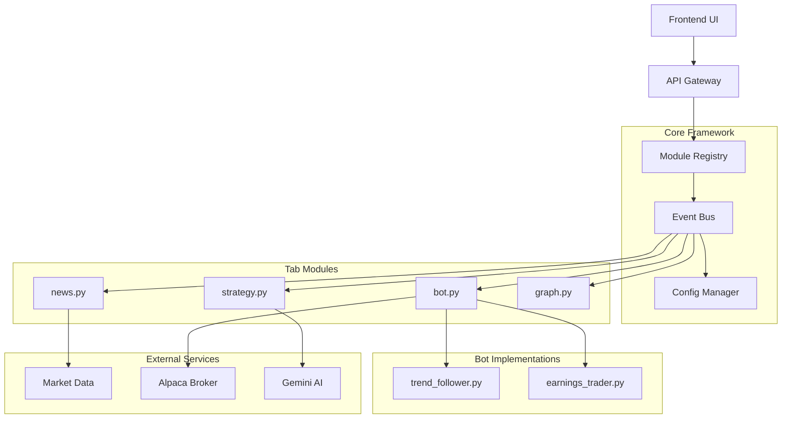

# Modular Python Architecture for The Sentient Trading System

## Current System Analysis

The existing system has:
- **Frontend**: Vue.js with tab-based interface (news, bot, chat/flex, strategy, earnings, backtesting, stocks)
- **Backend**: FastAPI with services organized in `backend/services/`
- **Legacy Bot**: Python trading bot with modules in `legacy_bot/modules/`
- **Additional Components**: Streamlit app, scripts, Docker setup

## Modular Architecture Design

### Core Principles
1. **One Python file per tab** - each UI tab corresponds to a modular component
2. **Each bot has its own Python file** inside `folderbot/` directory
3. **Plugin architecture** - modules can be dynamically loaded
4. **Clear interfaces** - standardized APIs for communication between modules
5. **Separation of concerns** - each module handles its own domain logic

### Directory Structure

```
TheSentient/
├── modular/
│   ├── __init__.py
│   ├── core/                    # Core framework
│   │   ├── __init__.py
│   │   ├── module_registry.py
│   │   ├── event_bus.py
│   │   └── config_manager.py
│   │
│   ├── modules/                 # Tab modules (one file per tab)
│   │   ├── __init__.py
│   │   ├── news.py
│   │   ├── bot.py              # Bot management module
│   │   ├── chat.py
│   │   ├── strategy.py
│   │   ├── earnings.py
│   │   ├── backtesting.py
│   │   ├── stocks.py
│   │   └── graph.py           # New graph module
│   │
│   ├── folderbot/              # Individual bot implementations
│   │   ├── __init__.py
│   │   ├── base_bot.py        # Abstract base class
│   │   ├── trend_follower.py
│   │   ├── mean_reversion.py
│   │   ├── earnings_trader.py
│   │   └── arbitrage_bot.py
│   │
│   ├── adapters/              # Adapters for existing services
│   │   ├── __init__.py
│   │   ├── market_data.py
│   │   ├── alpaca_service.py
│   │   └── gemini_service.py
│   │
│   └── api/                   # REST/WebSocket endpoints
│       ├── __init__.py
│       ├── router.py
│       └── endpoints/
│           ├── news.py
│           ├── bot.py
│           └── ...
│
├── backend/                   # Existing backend (to be refactored)
└── frontend/                  # Existing frontend
```

### Module Interface Specification

Each module must implement:

```python
class ModuleInterface:
    """Base interface for all tab modules"""
    
    def __init__(self, config: dict):
        self.config = config
        self.name = ""
        self.version = "1.0.0"
        
    def initialize(self) -> bool:
        """Initialize module resources"""
        pass
        
    def shutdown(self):
        """Clean up resources"""
        pass
        
    def get_state(self) -> dict:
        """Return current module state for frontend"""
        pass
        
    def handle_event(self, event_type: str, data: dict):
        """Handle events from other modules"""
        pass
        
    def get_api_routes(self) -> list:
        """Return FastAPI routes for this module"""
        pass
```

### Bot Interface Specification

Each bot in `folderbot/` must implement:

```python
class BotInterface:
    """Base interface for all trading bots"""
    
    def __init__(self, config: dict):
        self.config = config
        self.status = "stopped"
        
    def start(self):
        """Start bot execution"""
        pass
        
    def stop(self):
        """Stop bot execution"""
        pass
        
    def get_status(self) -> dict:
        """Return bot status"""
        pass
        
    def update_config(self, config: dict):
        """Update bot configuration"""
        pass
        
    def on_market_data(self, data: dict):
        """Handle incoming market data"""
        pass
```

### Event Bus Architecture

Modules communicate through a central event bus:



### Implementation Plan

#### Phase 1: Foundation
1. Create modular directory structure
2. Implement core framework (module registry, event bus, config manager)
3. Define interface protocols

#### Phase 2: Module Migration
1. Convert existing backend services to modules:
   - `news_service.py` → `modules/news.py`
   - `bot_service.py` → `modules/bot.py`
   - `strategy_service.py` → `modules/strategy.py`
   - `earnings_service.py` → `modules/earnings.py`
   - `backtest_service.py` → `modules/backtesting.py`
   - `market_data_service.py` → `modules/stocks.py`

2. Create new `graph.py` module for graph tab

#### Phase 3: Bot System Refactor
1. Extract bot logic from `bot_service.py` into `folderbot/`
2. Create base bot interface
3. Migrate existing bot types to individual files

#### Phase 4: API Integration
1. Create unified API router that loads routes from modules
2. Maintain backward compatibility with existing endpoints
3. Add WebSocket support for real-time updates

#### Phase 5: Frontend Integration
1. Update frontend to use new modular endpoints
2. Add dynamic module loading UI
3. Enhance tab management with module metadata

#### Phase 6: Testing & Deployment
1. Write unit tests for each module
2. Integration testing with existing system
3. Docker containerization for modular deployment

### Benefits

1. **Improved Maintainability**: Each module is isolated and can be developed independently
2. **Extensibility**: New tabs/bots can be added without modifying core code
3. **Better Collaboration**: Teams can work on different modules simultaneously
4. **Easier Testing**: Modules can be tested in isolation
5. **Dynamic Loading**: Modules can be loaded/unloaded at runtime
6. **Agent-Friendly**: Clear interfaces make it easier for AI agents to understand and manipulate the system

### Migration Strategy

The migration will be incremental:
1. New features use modular architecture
2. Existing functionality is gradually migrated
3. Dual operation during transition period
4. Comprehensive testing at each step

### Next Steps

1. Create the directory structure
2. Implement core framework
3. Migrate the first module (news) as a proof of concept
4. Iteratively migrate remaining modules
5. Test integration with frontend
6. Deploy and monitor performance