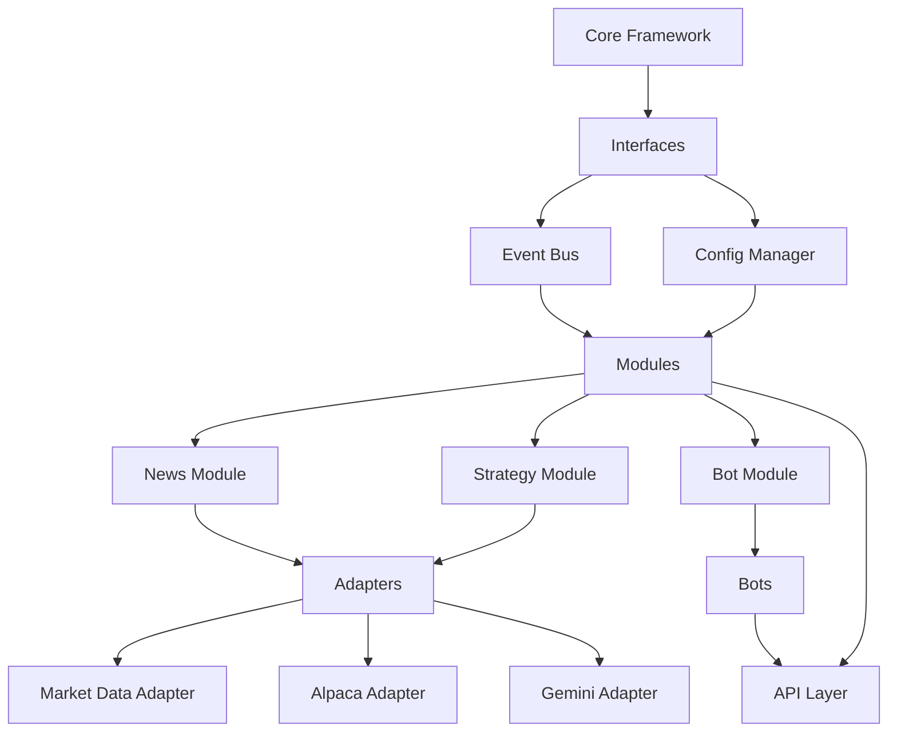

# Modular Import Architecture

## Overview
Design for how modules import and interact with each other in the modular system, ensuring clean separation while enabling necessary communication.

## Core Principles

1. **Explicit Dependencies** - Modules declare dependencies explicitly
2. **Interface-Based Communication** - Modules communicate via defined interfaces, not direct imports
3. **Loose Coupling** - Modules can be developed, tested, and deployed independently
4. **Dependency Injection** - Dependencies are injected, not hardcoded
5. **Circular Dependency Prevention** - Architecture prevents import cycles

## Import Structure

### 1. Core Framework (No External Dependencies)
```
src/modular/core/
├── __init__.py
├── interfaces.py          # Base interfaces (ModuleInterface, BotInterface)
├── module_registry.py     # Module discovery and management
├── event_bus.py          # Event-based communication
├── config_manager.py     # Configuration management
└── dependency_injector.py # Dependency injection container
```

### 2. Module Layer (Depends on Core Only)
```
src/modular/modules/
├── __init__.py           # Module exports
├── news.py              # News module
├── bot.py               # Bot management module
├── strategy.py          # Strategy module
├── earnings.py          # Earnings module
├── backtesting.py       # Backtesting module
├── stocks.py           # Stocks/graph module
└── chat.py             # Chat module
```

### 3. Bot Layer (Depends on Core and Module Interfaces)
```
src/modular/folderbot/
├── __init__.py          # Bot exports
├── base_bot.py         # Abstract BotInterface implementation
├── trend_follower.py   # Trend following bot
├── mean_reversion.py   # Mean reversion bot
├── earnings_trader.py  # Earnings trading bot
└── arbitrage_bot.py    # Arbitrage bot
```

### 4. Adapter Layer (Bridges to External Services)
```
src/modular/adapters/
├── __init__.py
├── market_data.py      # Market data adapter
├── alpaca_service.py   # Alpaca broker adapter
├── gemini_service.py   # Gemini AI adapter
├── database.py         # Database adapter
└── cache.py           # Cache adapter
```

### 5. API Layer (Depends on Modules)
```
src/modular/api/
├── __init__.py
├── router.py           # Main FastAPI router
└── endpoints/
    ├── __init__.py
    ├── news.py         # News endpoints
    ├── bot.py          # Bot endpoints
    ├── strategy.py     # Strategy endpoints
    └── ...
```

## Import Rules

### Rule 1: No Cross-Module Imports
Modules cannot directly import from other modules. Instead, they communicate via:
- **Event Bus** for asynchronous communication
- **Shared Services** injected via dependency injection
- **API Calls** for synchronous communication

### Rule 2: Dependency Direction
```
Core Framework
    ↑
Adapters
    ↑
Modules
    ↑
Bots
    ↑
API Layer
```

### Rule 3: Interface Definitions
All cross-boundary communication uses interfaces defined in `core/interfaces.py`:

```python
# core/interfaces.py
class ModuleInterface:
    """Base interface for all modules"""
    def initialize(self, config: dict) -> bool: ...
    def shutdown(self) -> None: ...
    def get_state(self) -> dict: ...
    def handle_event(self, event: Event) -> None: ...

class BotInterface:
    """Base interface for all bots"""
    def start(self) -> bool: ...
    def stop(self) -> bool: ...
    def get_status(self) -> dict: ...
    def on_market_data(self, data: MarketData) -> None: ...

class DataProviderInterface:
    """Interface for data providers"""
    def get_data(self, symbol: str, timeframe: str) -> pd.DataFrame: ...
    def subscribe(self, symbol: str, callback: Callable) -> None: ...
```

### Rule 4: Dependency Injection
All dependencies are provided via dependency injection:

```python
# Example module using DI
class NewsModule(ModuleInterface):
    def __init__(self, event_bus: EventBus, data_provider: DataProviderInterface):
        self.event_bus = event_bus
        self.data_provider = data_provider
        
    def initialize(self, config: dict) -> bool:
        # Register event handlers
        self.event_bus.subscribe("market_data_update", self.handle_market_data)
        return True
```

## Module Discovery and Loading

### 1. Discovery Mechanism
```python
# module_registry.py
class ModuleRegistry:
    def discover_modules(self):
        """Discover all modules in the modules/ directory"""
        module_dir = Path(__file__).parent / "modules"
        for file in module_dir.glob("*.py"):
            if file.name != "__init__.py":
                module_name = file.stem
                self.load_module(module_name)
    
    def load_module(self, module_name: str):
        """Dynamically load a module"""
        import importlib
        module = importlib.import_module(f"modular.modules.{module_name}")
        
        # Find ModuleInterface implementations
        for attr_name in dir(module):
            attr = getattr(module, attr_name)
            if (isinstance(attr, type) and 
                issubclass(attr, ModuleInterface) and 
                attr != ModuleInterface):
                instance = attr()  # Would use DI in reality
                self.register_module(module_name, instance)
```

### 2. Configuration-Based Loading
Modules can be enabled/disabled via configuration:
```yaml
# config/modules.yaml
modules:
  news:
    enabled: true
    config:
      sources: ["yahoo", "bloomberg"]
      update_interval: 300
  bot:
    enabled: true
    config:
      max_bots: 10
      auto_start: false
  strategy:
    enabled: false  # Disabled module
```

## Event-Based Communication

### Event Bus Architecture
```python
# core/event_bus.py
class Event:
    def __init__(self, type: str, data: dict, source: str):
        self.type = type
        self.data = data
        self.source = source
        self.timestamp = datetime.now()

class EventBus:
    def __init__(self):
        self.subscribers: Dict[str, List[Callable]] = defaultdict(list)
    
    def publish(self, event: Event):
        """Publish event to all subscribers"""
        for callback in self.subscribers[event.type]:
            try:
                callback(event)
            except Exception as e:
                print(f"Error in event handler: {e}")
    
    def subscribe(self, event_type: str, callback: Callable):
        """Subscribe to event type"""
        self.subscribers[event_type].append(callback)
```

### Event Types
```
market_data.update      # New market data
news.article            # New news article
bot.started             # Bot started
bot.stopped             # Bot stopped
trade.executed          # Trade executed
strategy.signal         # Strategy generated signal
user.notification       # User notification
system.alert            # System alert
```

## Dependency Management

### 1. Dependency Graph


### 2. Dependency Injection Container
```python
# core/dependency_injector.py
class Container:
    def __init__(self):
        self._services = {}
        self._factories = {}
    
    def register(self, interface: Type, implementation: Type):
        """Register implementation for interface"""
        self._services[interface] = implementation
    
    def get(self, interface: Type):
        """Get instance of interface"""
        if interface in self._services:
            impl = self._services[interface]
            return impl()
        raise ValueError(f"No implementation registered for {interface}")
    
    def build(self):
        """Build and wire all dependencies"""
        # Create core services
        event_bus = EventBus()
        config = ConfigManager()
        
        # Create adapters
        market_data = MarketDataAdapter(config)
        alpaca = AlpacaAdapter(config)
        
        # Create modules with dependencies
        news_module = NewsModule(event_bus, market_data)
        bot_module = BotModule(event_bus, config)
        
        return {
            'event_bus': event_bus,
            'config': config,
            'modules': [news_module, bot_module],
            'adapters': [market_data, alpaca]
        }
```

## Import Examples

### Correct Import Pattern
```python
# modules/news.py - CORRECT
from modular.core.interfaces import ModuleInterface, DataProviderInterface
from modular.core.event_bus import EventBus, Event

class NewsModule(ModuleInterface):
    def __init__(self, event_bus: EventBus, data_provider: DataProviderInterface):
        self.event_bus = event_bus
        self.data_provider = data_provider
    
    def handle_market_data(self, event: Event):
        # Process market data
        pass
```

### Incorrect Import Pattern (Avoid)
```python
# modules/news.py - INCorrect
from modular.modules.bot import BotModule  # NO: Cross-module import
from modular.folderbot.trend_follower import TrendFollowerBot  # NO: Direct bot import
```

### Module Communication via Events
```python
# modules/bot.py
class BotModule(ModuleInterface):
    def start_bot(self, bot_id: int):
        # Start a bot
        bot = self.bot_registry.get(bot_id)
        bot.start()
        
        # Publish event
        event = Event(
            type="bot.started",
            data={"bot_id": bot_id, "bot_type": bot.type},
            source="bot_module"
        )
        self.event_bus.publish(event)

# modules/strategy.py
class StrategyModule(ModuleInterface):
    def __init__(self, event_bus: EventBus):
        self.event_bus = event_bus
        self.event_bus.subscribe("bot.started", self.on_bot_started)
    
    def on_bot_started(self, event: Event):
        # React to bot started event
        bot_id = event.data["bot_id"]
        print(f"Strategy module notified of bot {bot_id} start")
```

## Testing Import Architecture

### 1. Import Validation Script
```python
# scripts/validate_imports.py
import ast
import importlib
from pathlib import Path

def validate_module_imports(module_path: Path):
    """Validate that a module follows import rules"""
    with open(module_path, 'r') as f:
        tree = ast.parse(f.read())
    
    issues = []
    for node in ast.walk(tree):
        if isinstance(node, ast.Import):
            for alias in node.names:
                if violates_rules(alias.name):
                    issues.append(f"Invalid import: {alias.name}")
        elif isinstance(node, ast.ImportFrom):
            if violates_rules(node.module):
                issues.append(f"Invalid import from: {node.module}")
    
    return issues
```

### 2. Circular Dependency Detection
```bash
# Use pytest with pytest-circulardependency
pytest --circulardependency
```

## Migration from Existing System

### 1. Create Adapter Layer
First, create adapters for existing services:
```python
# adapters/market_data.py
class MarketDataAdapter(DataProviderInterface):
    def __init__(self):
        # Import existing service
        from backend.services.market_data_service import MarketDataService
        self.service = MarketDataService()
    
    def get_data(self, symbol: str, timeframe: str):
        # Adapt existing service to interface
        return self.service.get_historical_data(symbol, timeframe)
```

### 2. Gradual Migration
1. Start with News module (simplest)
2. Create adapters for its dependencies
3. Test in isolation
4. Integrate with event bus
5. Repeat for other modules

### 3. Compatibility Layer
```python
# modular/compatibility.py
class CompatibilityLayer:
    """Bridge between modular system and existing backend"""
    def __init__(self):
        # Import existing FastAPI app
        from backend.main import app as legacy_app
        self.legacy_app = legacy_app
    
    def handle_request(self, request):
        """Route requests to appropriate system"""
        if request.path.startswith("/api/modular/"):
            # Forward to modular system
            return self.modular_handler(request)
        else:
            # Forward to legacy system
            return self.legacy_handler(request)
```

## Benefits of This Architecture

1. **Testability** - Modules can be tested in isolation
2. **Maintainability** - Clear boundaries make changes safer
3. **Scalability** - New modules can be added without affecting existing ones
4. **Reusability** - Modules can be reused in different contexts
5. **Debugability** - Clear dependency graph makes debugging easier
6. **Agent-Friendly** - AI agents can understand and manipulate the system more easily

## Implementation Checklist

- [ ] Define all interfaces in `core/interfaces.py`
- [ ] Implement event bus
- [ ] Implement dependency injection container
- [ ] Create adapter layer for existing services
- [ ] Migrate first module (news) to new architecture
- [ ] Set up import validation
- [ ] Create module discovery mechanism
- [ ] Implement configuration-based loading
- [ ] Test event-based communication
- [ ] Create compatibility layer for gradual migration